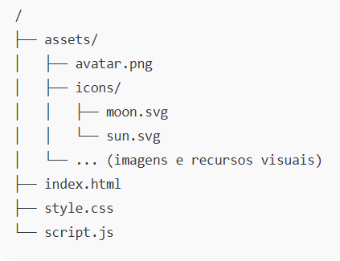

🌐 DevLinks – Página de Links Pessoais

Projeto simples e responsivo que reúne seus principais links profissionais e pessoais em um único lugar.
Ideal para usar como bio, cartão virtual ou para compartilhar rapidamente suas redes sociais.

## ✨ Preview

🛠️ Tecnologias Utilizadas

HTML5

CSS3

JavaScript

📌 Funcionalidades

Exibição do avatar e nome

Descrição profissional (Desenvolvedora | Analista de Dados)

Botões estilizados com ícones para:

GitHub

LinkedIn

Instagram

Portfólio

Layout moderno, limpo e totalmente responsivo

Background com gradiente suave

Interface inspirada em páginas “link-in-bio”

## 📂 Estrutura do Projeto

🚀 Como Executar

Basta abrir o arquivo index.html:

index.html

Ou publicar no GitHub Pages:

Vá em Settings

Clique em Pages

Selecione o branch main

Pasta: / (root)

Salve

📄 Licença

Projeto sob licença MIT 

👩‍💻 Autor

Cíntia Ramos
Desenvolvedora • Analista de Dados
